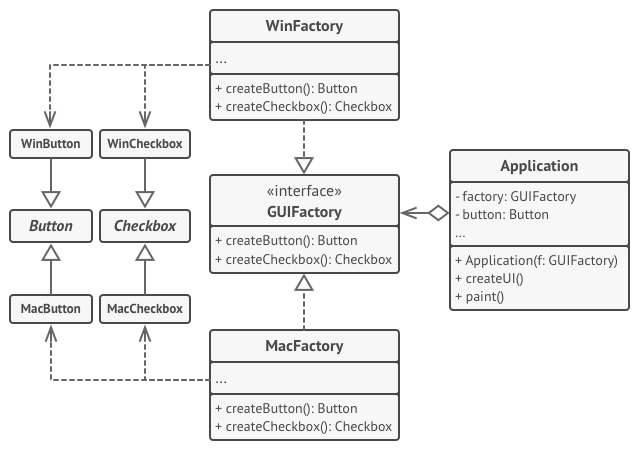

[Порождающие шаблоны](../../#readme) / [Абстрактная фабрика](../#readme) / Кросс-платформенный интерфейс

# Кросс-платформенный интерфейс (паттерн Абстрактная фабрика)

##  Описание

Вы создаете кросс-платформенное приложение, которое может работать и в вебе, и на Windows.

Вашему приложению нужны различные компоненты интерфейса для взаимодействия с пользователем. Но реализация разных компонентов отличается на разных платформах.

Вынесите создание компонентов для разных платформ в отдельные классы-фабрики (**Конкретные фабрики**). Каждая такая фабрика должна уметь создавать и **Кнопки**, и **Чекбоксы**, и **Модальные окна**.

Все фабрики имеют одинаковый интерфейс, что обеспечивается наличием **Абстрактной фабрики**. На каждой платформе вы просто выбираете подходящую фабрику и используете ее методы.

***
***

[Источник: refactoring.guru](https://refactoring.guru/ru/design-patterns/abstract-factory)
