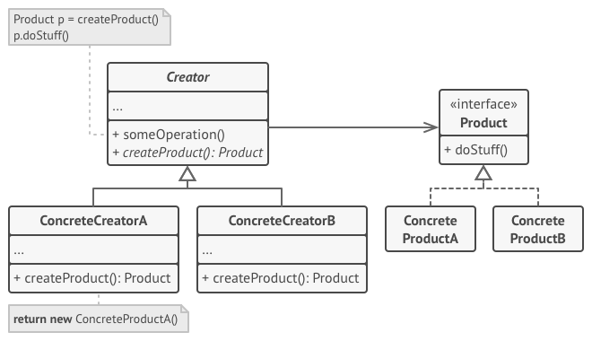

[Порождающие шаблоны](../#readme) / Фабричный метод

# Фабричный метод (Factory Method)

## Другие названия

* **Виртуальный конструктор** (Virtual Constructor)

## Содержание

* [Описание паттерна](#-описание-паттерна)
* [Реализация паттерна](#-реализация-паттерна)
* [Примеры](#-примеры)
* [Использование](#-использование)
* [Преимущества](#-преимущества)
* [Недостатки](#-недостатки)
* [Похожие паттерны](#-похожие-паттерны)
* [Взаимодействие с другими паттернами](#-взаимодействие-с-другими-паттернами)
* [Источники](#источники)

##  Описание паттерна

### Абстрактная ситуация. Машины и моторы

Вы производите на заводе три вида машин: `Маленькую`, `Среднюю` и `Большую`. Они очень похожи, но для работы им нужны разные моторы. В каком месте класса Машины нужно указать, какой мотор ей нужен?

Лучше, если создание мотора нужного типа будет вынесено в **отдельный метод**. Тогда вы легко сможете переопределить его у любого класса машины.

***

Фабричный метод выносится на самый верх иерархии классов (в родительский или абстрактный класс). То есть у класса есть некоторый метод, который производит объект, который нужен классу - **Фабричный метод**. Этот метод может быть абстрактным, чтобы каждый дочерний класс дал собственную реализацию или иметь некоторое дефолтное поведение (например, возвращать самый простой мотор).

**Конкретная реализация фабричного метода предоставляется дочерними классами**. Таким образом, каждый дочерний класс сам решает, какой именно объект создавать. `МаленькаяМашина` создает себе `МаленькийМотор`, а `БольшаяМашина` - `БольшойМотор`. При этом вся логика по выбору и созданию мотора находится в одном месте - в фабричном методе.

##  Реализация паттерна

* Иерархия создателей:
  * Родительский класс `Creator` определяет фабричный метод для создания объекта `FactoryMethod()`.
  * Конкретные создатели `ConcreteCreator` реализуют этот метод по-своему.
* Иерархия продуктов:
  * Порождаемые классы (продукты) тоже объединяются в отдельную иерархию, ведь они являются родственными и должны иметь одинаковый интерфейс. Класс `Product` предоставляет общий интерфейс продукта.
  * Классы `ConcreteProduct` определяют конкретные продукты.
* Каждый `КонкретныйСоздатель` в своей реализации `ФабричногоМетода` создает тот `КонкретныйПродукт`, который ему нужен.

##  Примеры

* [Фабрика пиццы](./pizza#readme)
* [Кросс-платформенные компоненты интерфейса](./dialog#readme)

##  Использование

* Неизвестно заранее, с каким типом объектов придется работать коду. Вынесение создания Продукта в отдельный метод позволяет легче им управлять.
* Нужна возможность расширения иерархии создателей. Например, вы создаете еще один тип машины - Трактор. Чтобы дать ему правильный мотор, нужно только реализовать фабричный метод класса.

##  Преимущества

* Абстрагирует создание продукта, убирает лишние привязанности.
* Упрощает поддержку кода создания продукта.
* Упрощает добавление новых продуктов и создателей.

##  Недостатки

* Иерархии создателей и продуктов быстро разрастаются.

##  Похожие паттерны

* [Строитель (Builder)](../builder#readme). Фабрика с более тонкой настройкой
* [Абстрактная фабрика (Abstract Factory)](../abstractFactory#readme). Фабрика фабрик
* [Прототип (Prototype)](../prototype#readme). Создание объектов через копирование

При усложнении паттерн `Фабричный метод` обычно следует заменить одним из этих паттернов.

##  Взаимодействие с другими паттернами

* Использование паттерна в структуре другого паттерна (один паттерн является частью другого)
  * [Абстрактная фабрика (Abstract Factory)](../abstractFactory#readme). Использует `Фабричный метод` для непосредственного создания классов.
  * [Шаблонный метод (Template)](../../behavioral/template#readme). `Фабричный метод` - частный случай `Шаблонного метода`.
* Способы реализации паттерна (вариации механизмов работы паттерна)
  * [Приспособленец (Flyweight)](../../structural/flyweight#readme). Позволяет повторно использовать уже существующие объекты, а не создавать их заново.
* Частое применение (паттерны не связаны напрямую)
  * [Итератор (Iterator)](../../behavioral/iterator#readme). Итераторы выступают в качестве продуктов, разным подклассам требуются разные итераторы.

## Источники

* [refactoring.guru](https://refactoring.guru/ru/design-patterns/factory-method)
