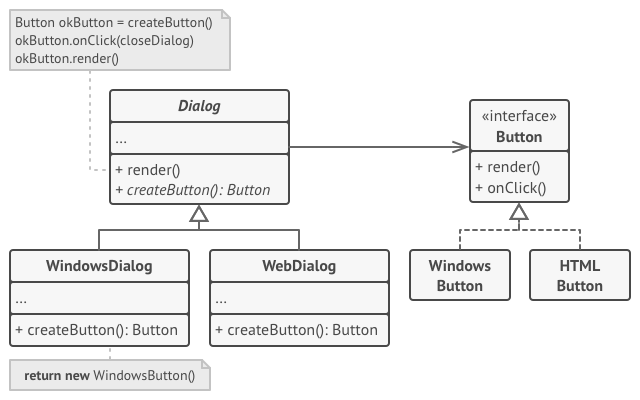

[Главная](../../.../#readme) / [Порождающие шаблоны](../../#readme) / [Фабричный метод](../#readme) / Кросс-платформенные компоненты интерфейса

# Кросс-платформенные компоненты интерфейса (паттерн Фабричный метод)

## Описание

Вы создаете кросс-платформенное приложение, которое может работать и в вебе, и на Windows.

Вашему приложению нужен компонент Диалога для взаимодействия с пользователем. Но реализация такого функционала отличается на разных платформах.

Вынесите создание компонента Диалог в отдельный метод (**Фабричный метод**). Тогда каждая конкретная реализация приложения (для разных платформ) сможет создавать собственный диалог.

***
***

[Источник: refactoring.guru](https://refactoring.guru/ru/design-patterns/factory-method)
