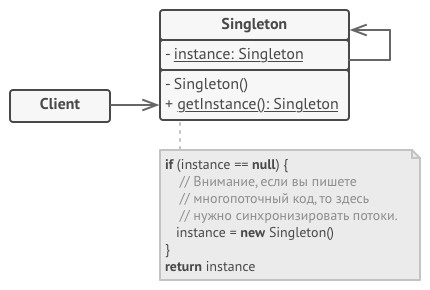

[Порождающие шаблоны](../#readme) / Одиночка

# Одиночка

## Другие названия

* **Синглтон** (Singleton)

## Содержание

* [Описание паттерна](#-описание-паттерна)
* [Реализация паттерна](#-реализация-паттерна)
* [Примеры](#-примеры)
* [Использование](#-использование)
* [Преимущества](#-преимущества)
* [Недостатки](#-недостатки)
* [Взаимодействие с другими паттернами](#-взаимодействие-с-другими-паттернами)
* [Источники](#источники)

##  Описание паттерна

Дает гарантию что в программе будет создан **ТОЛЬКО ОДИН** экземпляр класса (независимо от того, где происходит его вызов и попытка инициализации).

Другими словами, паттерн _ограничивает инстанцирование класса._

Синглтон - это некоторое глобальное состояние системы. Он может стать причиной сильной связи между элементами.

##  Реализация паттерна

Реализаций может быть несколько:

* глобальная переменная
* приватный конструктор класса
* шаблон Модуль

Для JavaScript особенно актуален последний вариант (создание замыкания).

Все реализации сводятся к скрытию конструктора класса и созданию некоторого статического метода доступа.

##  Примеры

* [Президент страны](./president#readme)
* Корзина товаров на сайте интернет-магазина. Вы не можете допустить повторного создания корзины, так как при этом могут быть потеряны имеющиеся данные клиента.
* Всплывающее окно авторизации. Независимо из какого места вашего приложения и по какой причине вызывается попап авторизации, вы, вероятно, хотите, чтобы это было одно и то же окно, а не два разных.
* Доступ к базе данных, доступный всем клиентам программы.

##  Использование

* Если некоторый объект должен быть в программе в единственном экземпляре по каким-то причинам (хранит общие данные, сложно создается).
* Требуется больший контроль, чем при использовании глобальных переменных (Одиночку нельзя переопределить).

##  Преимущества

* Гарантирует наличие единственного экземпляра класса.
* Предоставляет к нему глобальную точку доступа.
* Реализует отложенную инициализацию объекта-одиночки.
* Позволяет хранить много данных в одном месте, не засоряя глобальное пространство имен.

##  Недостатки

* Нарушает принцип единственной ответственности класса (решает сразу две проблемы - гарантирует наличие единственного экземпляра и предоставляет глобальную точку доступа).
* Маскирует плохой дизайн.
* Проблемы мультипоточности.
* Требует постоянного создания Mock-объектов при юнит-тестировании.

##  Взаимодействие с другими паттернами

* Частое применение (паттерны не связаны напрямую)
  * [Абстрактная фабрика (Abstract factory)](../abstractFactory#readme), [Строитель (Builder)](../builder#readme), [Прототип (Prototype)](../prototype#readme), [Фасад (Facade)](../../structural/facade#readme). Могут быть реализованы как `Одиночки`.

## Источники

* [refactoring.guru](https://refactoring.guru/ru/design-patterns/singleton)
* [wikipedia](https://ru.wikipedia.org/wiki/%D0%9E%D0%B4%D0%B8%D0%BD%D0%BE%D1%87%D0%BA%D0%B0_(%D1%88%D0%B0%D0%B1%D0%BB%D0%BE%D0%BD_%D0%BF%D1%80%D0%BE%D0%B5%D0%BA%D1%82%D0%B8%D1%80%D0%BE%D0%B2%D0%B0%D0%BD%D0%B8%D1%8F))
