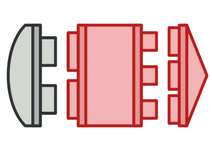

[Структурные шаблоны](../#readme) / Адаптер

# Адаптер (Adapter)


## Содержание

* [Описание паттерна](#-описание-паттерна)
* [Реализация паттерна](#-реализация-паттерна)
* [Примеры](#-примеры)
* [Использование](#-использование)
* [Преимущества](#-преимущества)
* [Недостатки](#-недостатки)
* [Похожие паттерны](#-похожие-паттерны)
* [Источники](#источники)


<p style="text-align: center">
  
</p>


##  Описание паттерна

Если кто-то ходит, как утка, и крякает, как утка, то это ~~и есть~~ может быть ~~утка~~ индюшка с утиным адаптером...

Если объект, с которым нужно взаимодействовать, не удовлетворяет требованиям клиента и не подлежит изменению (сторонняя библиотека), с помощью адаптера ему можно *"прикрутить" необходимый интерфейс*.

Паттерн `Адаптер` **изменяет интерфейс** объекта без изменения его внутреннего кода.


##  Реализация паттерна


* `Adaptee` - исходный класс с неподходящим интерфейсом (метод `specificRequest()`)
* `Adapter` - адаптер, оборачивающий исходный класс и предоставляющий ожидаемый интерфейс (в методе `request()` вызывается метод `specificRequest` исходного класса)
* `Target` - конечный объект с ожидаемым интерфейсом (метод `request()`).

**Важно!**:

* Интерфейс `Адаптера` совместим с интерфейсом одного из взаимодействующих объектов.


##  Примеры

* Вася из Питера, а Петя из Москвы. Вася просит Петю ```слезтьСПоребрика()```, но Петя его не понимает. Если бы Петя знал, что Вася просит его просто сойти с бордюра, он бы легко это сделал, потому что У Пети есть встроенная функция ```cойтиСБордюра()```. Этим двоим просто нужен адаптер.
* [Проблема с печеньками](./cookies#readme)
* [Отверстия и колышки](./pegInHole#readme)
* Если одна часть вашего приложения использует данные в формате XML, а другая - в формате JSON, то для того, чтобы они могли взаимодействовать вам потребуется `Адаптер`.
* Создание единого интерфейса для работы с разными СУБД.


##  Использование

* Если необходимо использовать сторонний класс, интерфейс которого не соответствует коду приложения.


##  Преимущества

* Инкапсулирует подробности преобразования интерфейсов. Позволяет организовать взаимодействие.
* Позволяет внести изменения в уже написанном приложении, без глобальной переделки архитектуры.


##  Недостатки

* Усложняет код программы из-за введения дополнительных классов.


##  Похожие паттерны

Шаблон `Адаптер` меняет интерфейс исходного объекта.

* [Декоратор (Decorator)](../decorator#readme) - дополняет интерфейс исходного объекта. Адаптер очень похож на `Декоратор` по структуре. Он тоже принимает некоторый объект и "оборачивает" его. Но основная роль Адаптера - *не дополнить функциональность* объекта, а вызвать необходимый метод. Предполагается, что объект все умеет сам, просто не понимает, чего от него хотят.
* [Заместитель (Proxy)](../proxy#readme) - сохраняет интерфейс исходного объекта.
* [Фасад (Facade)](../facade#readme) - оборачивает целую подсистему классов, чтобы облегчить взаимодействие с ними.
* [Мост (Bridge)](../bridge#readme) - обеспечивает взаимодействие двух больших частей приложения.


## Источники

* [refactoring.guru](https://refactoring.guru/ru/design-patterns/adapter)
* [wikipedia](https://ru.wikipedia.org/wiki/%D0%90%D0%B4%D0%B0%D0%BF%D1%82%D0%B5%D1%80_(%D1%88%D0%B0%D0%B1%D0%BB%D0%BE%D0%BD_%D0%BF%D1%80%D0%BE%D0%B5%D0%BA%D1%82%D0%B8%D1%80%D0%BE%D0%B2%D0%B0%D0%BD%D0%B8%D1%8F))
