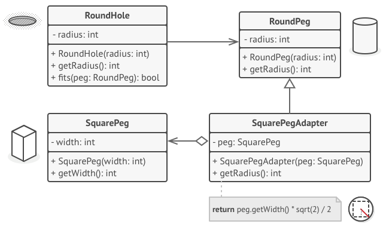

[Структурные шаблоны](../../#readme) / [Адаптер](../#readme) / Отверстия и колышки

# Отверстия и колышки (паттерн Адаптер)


##  Описание

Знаете игру, в которой нужно поместить колышки разного сечения в соответствующие отверстия?

Напишем адаптер, который будет выдавать квадратные колышки за круглые.



***
***

**Обман века**: [index.js](./index.js)

**Команда для запуска кода**:

```
npm run adapter:pegInHole
```

***
***

[Источник: refactoring.guru](https://refactoring.guru/ru/design-patterns/adapter)
