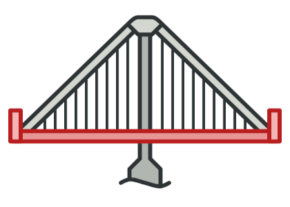
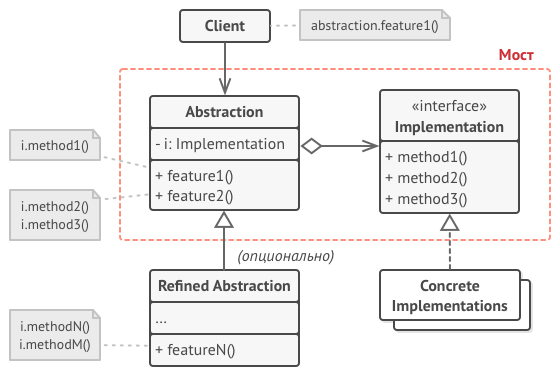

[Структурные шаблоны](../#readme) / Мост

# Мост (Bridge)

## Содержание

* [Описание паттерна](#-описание-паттерна)
* [Реализация паттерна](#-реализация-паттерна)
* [Примеры](#-примеры)
* [Использование](#-использование)
* [Преимущества](#-преимущества)
* [Недостатки](#-недостатки)
* [Похожие паттерны](#-похожие-паттерны)
* [Взаимодействие с другими паттернами](#-взаимодействие-с-другими-паттернами)
* [Источники](#источники)

  

##  Описание паттерна

Позволяет **разделять абстракцию и реализацию**, чтобы они могли изменяться независимо друг от друга.

Вместо того, чтобы создавать дерево классов с разной реализацией, `Мост` создает *отдельную иерархию реализаций* и подключает реализацию с помощью композиции (вместо наследования).

`Абстракция` здесь - это образное выражение. Она представляет собой слой управления, который не делает работу самостоятельно, а делегирует ее слою `Реализации` (платформе).

##  Реализация паттерна

* `Implemention` определяет общий интерфейс для всех конкретных реализаций (метод `OperationImg()`)
* Конкретные реализации `ConcreteImplementions` реализуют этот интерфейс по-своему
* `Abstraction` - общий интерфейс для абстракции приложения
* `RefinedAbstraction` - уточненная абстракция, реализующая этот интерфейс
* Объект с интерфейсом `Implementor` с помощью композиции включается в объект с интерфейсом `Abstraction`
* Клиент работает только с абстракциями.

##  Примеры

* [Крестики-нолики](./ticTacToe#readme)
* [Чернила в принтере](./printer#readme)
* [ПДУ](./remote#readme)

##  Использование

* Если у вас есть монолитный класс, который содержит несколько различных реализаций какой-то функциональности (например, если класс может работать с разными системами баз данных).
* Когда класс нужно расширять в двух независимых плоскостях - одну из таких плоскостей можно выделить в отдельную иерархию классов и ссылаться на нее.
* Когда вы хотите, чтобы реализацию можно было бы изменять во время выполнения программы. (В этом `Мост` похож на `Стратегию`, но это не его основная задача).

##  Преимущества

* Позволяет строить платформо-независимые программы.
* Скрывает лишние или опасные детали реализации от клиентского кода.

##  Недостатки

* Усложняется код программы.

##  Похожие паттерны

* [Состояние (State)](../behavioral/state#readme)
* [Стратегия (Strategy)](../behavioral/strategy#readme)
* [Адаптер (Adapter)](../behavioral/adapter#readme)

Все эти паттерны имеют похожие структуры: они построены на принципе композиции - делегирования работы другим объектам. Но все они решают разные проблемы.

##  Взаимодействие с другими паттернами

**Способы реализации паттерна (вариации механизмов работы паттерна)**

* [Абстрактная фабрика (Abstract Factory)](../../creational/abstractFactory#readme). Комбинация этих паттернов полезна, если некоторые абстракции могут работать не со всеми реализациями. Фабрика будет определять типы абстракций и реализаций.
* [Строитель (Builder)](../../creational/builder#readme). Строитель может быть оформлен в виде `Моста`, где `Директор` - абстракция, а `Строители` - реализации.

## Источники

* [refactoring.guru](https://refactoring.guru/ru/design-patterns/bridge)
* [wikipedia](https://ru.wikipedia.org/wiki/%D0%9C%D0%BE%D1%81%D1%82_(%D1%88%D0%B0%D0%B1%D0%BB%D0%BE%D0%BD_%D0%BF%D1%80%D0%BE%D0%B5%D0%BA%D1%82%D0%B8%D1%80%D0%BE%D0%B2%D0%B0%D0%BD%D0%B8%D1%8F))
