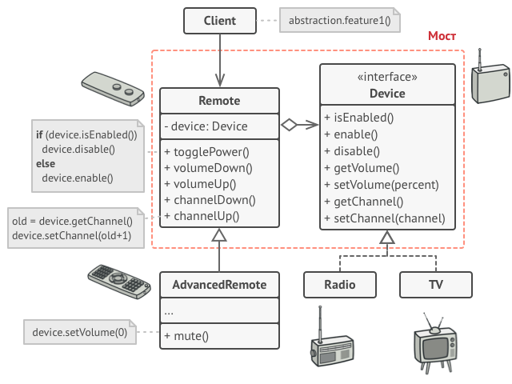

[Структурные шаблоны](../../#readme) / [Мост](../#readme) / Пульт дистанционного управления

# Пульт дистанционного управления (паттерн Мост)

##  Описание

Взаимодействие с телевизором и другими приборами через ПДУ можно описать с помощью паттерна Мост.

Телевизор - это `Реализация`, пульт - `Абстракция`, с которой вы можете взаимодействовать.

У пульта (`Абстракции`) есть ссылка на `Реализацию` (объект прибора). Если у приборов общий интерфейс, то пульт может быть связан с разными приборами (разными `Реализациями`).

Благодаря разделению, `Абстракцию` и `Реализацию` можно развивать и изменять отдельно друг от друга.

Например, можно добавить пульту тач-интерфейс, но это никак не повлияет на его взаимодействие с прибором.

***
***

Источник: [refactoring.guru](https://refactoring.guru/ru/design-patterns/bridge)
