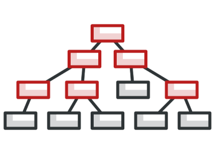
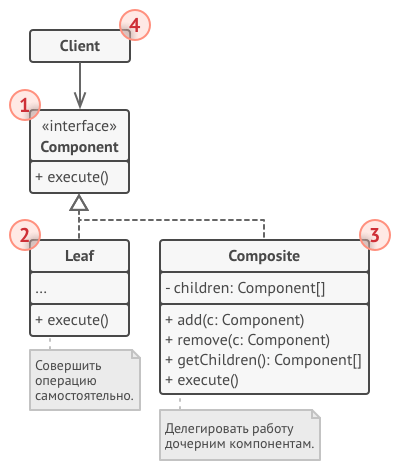

[Структурные шаблоны](../#readme) / Компоновщик

# Компоновщик (Composite)

## Содержание

* [Описание паттерна](#-описание-паттерна)
* [Реализация паттерна](#-реализация-паттерна)
* [Примеры](#-примеры)
* [Использование](#-использование)
* [Похожие паттерны](#-похожие-паттерны)
* [Взаимодействие с другими паттернами](#-взаимодействие-с-другими-паттернами)
* [Источники](#источники)

  

##  Описание паттерна

Облегчает работу со структурами объектов, позволяет одинаковым образом работать с *объектами* и *группами этих объектов* (элементами иерархии). Выстраивает объекты и их комбинации в виде иерархического дерева.

Сохраняет *общий интерфейс для всех элементов структуры* (листьев и узлов).

Некоторые методы имеют смысл только для листьев, другие - только для узлов. Но реализуются и там, и там, так как это объекты одного класса. Это небольшая жертва удобству работы.

##  Реализация паттерна

* Интерфейс `Компонент` определяет общий интерфейс для всех единиц дерева (и `композитов`, и `листьев`).
* `Лист` - это простой компонент дерева, у которого нет дочерних элементов.
* `Композит` (или контейнер) - это составной компонент. У него есть дети, но он не знает, являются ли они `листьями` или `композитами`.

Паттерн реализуется рекурсивно. Каждый узел дерева вызывает методы своих детей - пока не дойдет до листьев.

Большая часть кода находится в `листьях`, потому что именно им приходится выполнять всю логику. Сложные компоненты обычно просто агрегируют результаты своих детей.

##  Примеры

* [Покупка кухни](./kitchen#readme)
* Организация армии. Каждый солдат, взвод, полк - является боевой единицей. Приказы отдаются сверху и спускаются вниз до отдельных солдат.
* Векторная графика. Изображение состоит из сложных составных фигур, которые раскладываются на примитивы (circle, rect, line).

##  Использование

* Если основная модель программы может быть структурирована в виде дерева.
* Если клиенты одинаково взаимодействуют с простыми и составными объектами.

##  Похожие паттерны

* [Декоратор (Decorator)](../decorator#readme). Также используют рекурсивную вложенность для связи большого количества объектов в одну структуру.
* [Цепочка обязанностей (Chain of Responsibility)](../../chainOfResponsibility#readme). Также построена на рекурсивном выполнении операций.

##  Взаимодействие с другими паттернами

**Способы реализации паттерна (вариации механизмов работы паттерна)**

* [Строитель (Builder)](../../creational/builder#readme). Позволяет пошагово сооружать дерево `Компоновщика`.
* [Приспособленец (Flyweight)](../flyweight#readme). Позволяет реализовать общие ветки дерева, сэкономив память.
* [Прототип (Prototype)](../../creational/prototype#readme). Позволяет клонировать сложные структуры компоновщика.

**Частое применение (паттерны не связаны напрямую)**

* [Цепочка обязанностей (Chain of Responsibility)](../../behavioral/chainOfResponsibility#readme). Позволяет передавать запрос от дочерних компонентов - родителям.
* [Итератор (Iterator)](../../behavioral/iterator#readme). Может использоваться для обхода дерева.

## Источники

* [refactoring.guru](https://refactoring.guru/ru/design-patterns/composite)
* [wikipedia](https://ru.wikipedia.org/wiki/%D0%9A%D0%BE%D0%BC%D0%BF%D0%BE%D0%BD%D0%BE%D0%B2%D1%89%D0%B8%D0%BA_(%D1%88%D0%B0%D0%B1%D0%BB%D0%BE%D0%BD_%D0%BF%D1%80%D0%BE%D0%B5%D0%BA%D1%82%D0%B8%D1%80%D0%BE%D0%B2%D0%B0%D0%BD%D0%B8%D1%8F))
